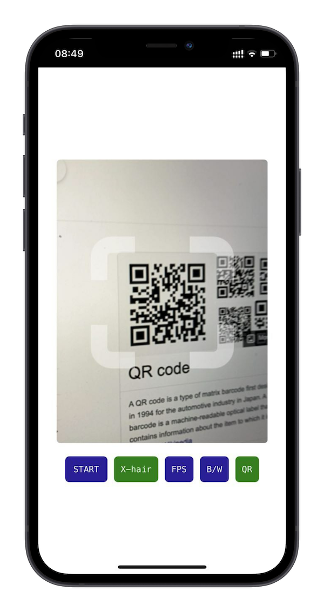
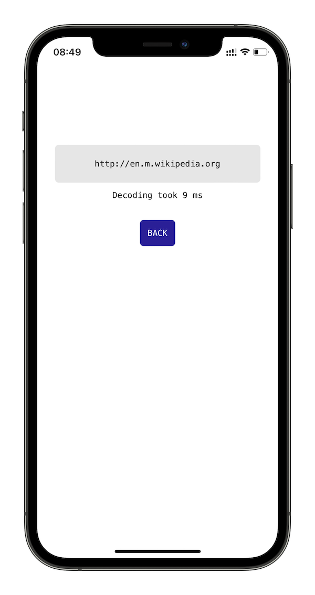

# =koder=
QR/bar code scanner for the Browser

[](https://www.npmjs.com/package/@maslick/koder)
[](https://github.com/maslick/koder-react/actions?query=workflow%3Abuild)
[](./LICENSE)

## :bulb: Demo
https://qr.maslick.tech


## 🚀 Features
* QR/barcode module implemented in WebAssembly
* Barcode support (UPC-A, UPC-E, EAN-8, EAN-13, I25, CODE-128)
* Uses Zbar C++ library (version [0.23.90](https://github.com/mchehab/zbar))
* Packaged as PWA (caching files with Service Worker, Add to Home Screen)
* Mobile first (can be used on a Laptop as well)
* Multiplatform (iOS, Android, Desktop)
* QR/bar code recognition logic is performed off the browser's Main thread (i.e. Web Worker)
* *koder* React component supports a [jsqr](https://www.npmjs.com/package/jsqr) based Web Worker (see [jsQrWorker.js](./public/jsQrWorker.js))
* Emscripten-zbar-sdk [Docker image](https://hub.docker.com/r/maslick/emscripten-zbar-sdk) based on `emscripten/emsdk`, [Dockerfile](./docker/Dockerfile)
* ReactJS [component](./src/components/scan.js)
* Vanilla JS [example](https://github.com/maslick/koder-vanilla-js)
* :new: Turn on/off the beep sound
* :new: Support for UPN QR (Slovenia only)
* :new: EU Digital Covid Certificate validator (vaccination, test), works in ``offline`` mode!
* :new: Emscripten v3.1.1
* :new: npm package


<p align="center" >
  
  
</p>

## ⚡ Usage

### Install dependencies
```shell
npm install --global yarn
yarn install --frozen-lockfile
```

### Run React app
```shell
npm run start
open https://locahost:8080
```

### Productionize
```shell
npm run build                # -> build React app into ./public
npm run prod                 # -> serve static web app on port 8082
open http://localhost:8082
```

## ⚡ NPM module
```
npm install @maslick/koder
```

```javascript
// CommonJS
const Koder = require('@maslick/koder');

// ES6 modules
import Koder from '@maslick/koder';
```

```javascript
const Koder = require('@maslick/koder');
const {loadImage, createCanvas} = require("canvas");

const getImageData = async (src) => {
  const img = await loadImage(src);
  const canvas = createCanvas(img.width, img.height);
  const ctx = canvas.getContext('2d');
  ctx.drawImage(img, 0, 0);
  return {
    data: ctx.getImageData(0, 0, img.width, img.height).data,
    width: img.width,
    height: img.height
  };
};

(async () => {
  const url = 'https://raw.githubusercontent.com/maslick/koder/master/screenshots/app_1.png';
  const koder = await new Koder().initialized;
  const {data, width, height} = await getImageData(url);

  const t0 = new Date().getTime();
  const res = koder.decode(data, width, height);
  const t1 = new Date().getTime();

  console.log(`Scanned in ${t1-t0} ms`);  // Scanned in 7 ms
  console.log(res);                       // http://en.m.wikipedia.org
})();
```

## :spades: Development

### Fetch or build the Builder image
```shell
docker pull maslick/emscripten-zbar-sdk
docker build -t maslick/emscripten-zbar-sdk -f docker/Dockerfile docker
```

### Build WASM artifacts
```shell
# React app
docker run \
  -e INPUT_FILE=zbar/qr.cpp \
  -e OUTPUT_FILE=zbar \
  -e OUTPUT_DIR=public/wasm \
  -v $(pwd):/app \
  maslick/emscripten-zbar-sdk make -B
```

### Clean the build artifacts (if necessary):
```shell
# React app
OUTPUT_DIR=public/wasm OUTPUT_FILE=zbar make clean
```


## 🔭 References
* [WebAssembly at Ebay](https://tech.ebayinc.com/engineering/webassembly-at-ebay-a-real-world-use-case/)
* [Barcode Scanner WebAssembly](https://barkeywolf.consulting/posts/barcode-scanner-webassembly/)
* [zbar.wasm](https://github.com/samsam2310/zbar.wasm)
